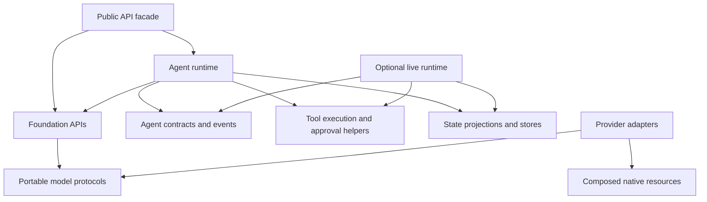

# SDK architecture

The SDK keeps portable model execution and agent orchestration behind the documented public entrypoints. Internal modules are implementation details. Existing root imports, positional constructors, historical pickle paths and serialized checkpoints remain compatible; the distribution remains Beta.

## Dependency direction



`agent.py` retains agent configuration, ordinary orchestration and compatible public functions. It delegates live execution through a lazy import. The implementation is divided by responsibility:

| Internal module | Responsibility |
| --- | --- |
| `_agent_contracts` | Context, approvals, guardrails, events, trace and result contracts |
| `_agent_context` | Shared message formatting |
| `_agent_tools` | Local/HTTP/MCP runtimes, discovery and tool fingerprints |
| `_agent_execution` | Cancellation, lifecycle hooks, instructions and context preparation |
| `_agent_approvals` | Approval policy normalization and approved-tool execution |
| `_agent_skills` | Skill selection, activation and event emission |
| `_agent_run_state` | Durable state projections, result reconstruction and checkpoints |
| `_agent_memory` | In-memory memory and checkpoint stores |
| `_agent_persistence`, `agent_state`, `_postgres_store` | Serialization, durable stores, pool ownership and schema initialization |
| `_agent_streams`, `_agent_live` | Stream ownership and realtime execution |

Contracts do not import the agent runtime or run-state implementations at execution time. Storage implementations do not call back into `agent.py`. Type-only references are permitted for annotations. The portable foundation and agent helpers cannot import hosting, CLI, evaluations, workflows or experimental extensions. The existing observer and emitter hooks remain the incremental event-export boundary.

## Execution budgets

Foundation, agent and gateway APIs accept an optional `total_timeout_ms`. A shared monotonic deadline covers awaited model calls, tools, retry backoff, fallback targets and streaming production. Nested calls inherit the remaining deadline and cannot extend it. Agent budgets include middleware, resumed approvals and realtime startup; the existing `RunLimits.max_wall_time_ms` also uses monotonic elapsed time. Wall-clock timestamps remain in persistent records for audit purposes.

`timeout_ms` retains its per-call meaning. Adapters retain exponential retry backoff and gateway retains linear backoff by default. Both respect `Retry-After`; `retry_jitter` is an optional finite fraction from zero to one. Budget expiry cancels awaited work and raises `TimeoutError`. It does not roll back an external write. Streams remain explicitly owned and must be closed on disconnect.

```python
result = await run_agent(
    agent=agent,
    prompt="Summarize the project status",
    timeout_ms=10_000,
    total_timeout_ms=30_000,
    retry_jitter=0.2,
)
```

## Storage lifecycle

SQLite run-store methods execute the entire transaction in a worker thread. Compare-and-swap revisions, atomic idempotency claims and approval claims retain their existing semantics. Inputs are snapshotted before worker dispatch. Cancellation can occur while a worker finishes its transaction: reload durable state before retrying. Use `await SQLiteAgentRunStore.open(path)` for nonblocking construction and schema migration; the compatible constructor remains synchronous.

PostgreSQL agent memory, checkpoint and run stores lazily create a bounded pool and initialize schema once per store instance. Transactional advisory locks serialize schema changes across instances. Initialize before serving requests and close during shutdown:

```python
async with create_postgres_agent_run_store(
    dsn,
    pool_min_size=1,
    pool_max_size=5,
) as store:
    state = await store.load(run_id)
```

Passing `pool=` borrows an application-owned pool. Closing a store releases its leases and closes only an owned pool. Share a borrowed pool when multiple stores should use one connection budget. Pool shutdown should occur after in-flight operations have finished.

## Retention

`Agent(trace_event_limit=4096, ...)` retains the latest trace events and supplies the default agent stream buffer limit. Explicit `stream_buffer_size` overrides replay retention. `trace.events` remains a list and `trace.events_dropped` reports evictions. Emitters and observers receive events incrementally even when trace retention is finite.

Unlimited replay remains the compatibility default. Finite buffers fail explicitly for lagging consumers. Event-count limits do not bound final text, messages, tools, artifacts or the size of individual payloads; use output-token limits, bounded tools and run limits as well. Durable audit history belongs in an application-owned event sink.

## Provider composition and capabilities

`ProviderAdapter` composes lazy native clients through `NativeExtensions`; legacy factories and typed methods delegate through a compatibility facade. A provider can add a resource without adding another cache or method to the portable adapter. Failed factory initialization is not cached.

Hosted-tool request constraints are declared by `AgentCapabilities`: named hosted-tool choice, hosted-only required choice and accepted provider aliases. Shared validation consumes these declarations rather than branching on provider names. Provider-level service availability, per-model capabilities, parameter constraints and release certification remain distinct evidence layers. Adding native resources does not promote their stability.

## Verification

`make test-architecture` checks dependency boundaries with an AST detector, including imports inside functions and ignoring only explicit type-checking branches. It also verifies that importing the core, `Agent` and the OpenAI factory does not load optional runtime packages. The command is part of `make check` and CI.

The regression suites cover lock-induced event-loop contention, concurrent durable claims, cancelled SQLite writes, pool ownership, failed initialization, shared deadlines, suspended stream cleanup, trace retention, approved resume and realtime startup. `make check` additionally validates typing, public stubs, generated support metadata and coverage. Credential-gated PostgreSQL/live tests remain separate evidence and must be run against the target environment before making deployment or certification claims.
